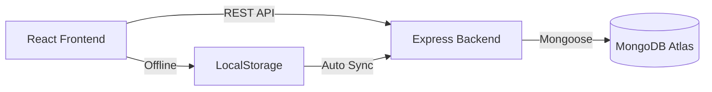

<div align="center">

# 💰 Expense Tracker

### _Track your finances with style and simplicity_

A beautiful, full-stack expense tracking application with real-time sync, offline support, and stunning visualizations.

[](https://react.dev/)
[](https://nodejs.org/)
[](https://www.mongodb.com/)
[](https://tailwindcss.com/)
[](LICENSE)

[Live Demo](#) • [Report Bug](https://github.com/GouravSittam/daily-expense-trackerXpenthara/issues) • [Request Feature](https://github.com/GouravSittam/daily-expense-trackerXpenthara/issues)

</div>

---

## ✨ Features

<table>
<tr>
<td width="50%">

### 🎯 Core Features

- 📝 **Smart Expense Entry** - Quick form with validation
- 🔍 **Advanced Filtering** - By category, date range
- 🔄 **Flexible Sorting** - Date, amount, or category
- 💰 **Live Summaries** - Real-time category totals
- 📊 **Visual Analytics** - Interactive charts & graphs
- 📱 **Fully Responsive** - Perfect on any device

</td>
<td width="50%">

### ⚡ Advanced Features

- 🌐 **Full-Stack API** - RESTful backend with Express
- 💾 **MongoDB Storage** - Cloud database with Atlas
- 📡 **Offline Mode** - Works without internet
- 🔄 **Auto-Sync** - Syncs when back online
- 🎨 **Modern Design** - Clean, aesthetic UI
- 🚀 **Fast Performance** - Optimized with Vite

</td>
</tr>
</table>

## 🚀 Quick Start

### Prerequisites

```bash
Node.js 18+  |  MongoDB Atlas Account  |  Git
```

### Installation

```bash
# 1. Clone the repository
git clone https://github.com/GouravSittam/daily-expense-trackerXpenthara.git
cd daily-expense-trackerXpenthara

# 2. Install frontend dependencies
npm install

# 3. Install backend dependencies
cd backend
npm install

# 4. Configure environment variables
# Create backend/.env file with your MongoDB URI
echo "MONGODB_URI=your_mongodb_atlas_connection_string" > .env
echo "PORT=5000" >> .env

# 5. Start the backend server
npm run dev
# Backend runs on http://localhost:5000

# 6. In a new terminal, start the frontend
cd ..
npm run dev
# Frontend runs on http://localhost:5173
```

### 🎉 That's it! Open http://localhost:5173 in your browser

---

## 🏗️ Architecture

<div align="center">



</div>

### Tech Stack

**Frontend**

- ⚛️ React 19 - UI library
- 🎨 Tailwind CSS 4 - Styling framework
- ⚡ Vite - Build tool
- 📊 Recharts - Chart library
- 🎬 GSAP & Framer Motion - Animations

**Backend**

- 🟢 Node.js & Express - Server framework
- 🍃 MongoDB & Mongoose - Database
- ✅ Express Validator - Input validation
- 🔒 CORS enabled - Cross-origin requests

## 📁 Project Structure

```
pentharaTech/
├── 📁 frontend/
│   ├── src/
│   │   ├── components/
│   │   │   ├── ExpenseForm.jsx       # 📝 Add expense form
│   │   │   ├── ExpenseList.jsx       # 📋 List with filters
│   │   │   ├── ExpenseSummary.jsx    # 💰 Category summary
│   │   │   ├── ChartComponent.jsx    # 📊 Data visualization
│   │   │   ├── OfflineIndicator.jsx  # 📡 Sync status
│   │   │   └── Shuffle.jsx           # ✨ Animated text
│   │   ├── pages/
│   │   │   └── ExpenseTracker.jsx    # 🏠 Main page
│   │   ├── services/
│   │   │   └── ExpenseService.js     # 🔄 API & offline logic
│   │   └── utils/
│   │       └── constants.js          # 🛠️ Helpers & constants
│   └── package.json
│
├── 📁 backend/
│   ├── config/
│   │   └── database.js               # 🔌 MongoDB connection
│   ├── controllers/
│   │   └── expenseController.js      # 🎮 Business logic
│   ├── models/
│   │   └── Expense.js                # 📐 Mongoose schema
│   ├── routes/
│   │   └── expenseRoutes.js          # 🛣️ API endpoints
│   ├── middleware/
│   │   ├── errorHandler.js           # ❌ Error handling
│   │   └── validateRequest.js        # ✅ Validation
│   ├── server.js                     # 🚀 Entry point
│   └── package.json
│
└── 📄 Documentation files
```

## 📋 Available Scripts

### Frontend

| Command           | Description                             |
| ----------------- | --------------------------------------- |
| `npm run dev`     | 🚀 Start development server (port 5173) |
| `npm run build`   | 📦 Build for production                 |
| `npm run preview` | 👀 Preview production build             |
| `npm run lint`    | 🔍 Check code quality                   |

### Backend

| Command       | Description                         |
| ------------- | ----------------------------------- |
| `npm run dev` | 🚀 Start with nodemon (auto-reload) |
| `npm start`   | ▶️ Start production server          |
| `npm test`    | 🧪 Run tests                        |

## 🎯 Usage Guide

### 📝 Adding Expenses

<table>
<tr>
<td width="30%"><b>Step 1</b></td>
<td>Fill in the form with amount, category, date, and optional description</td>
</tr>
<tr>
<td><b>Step 2</b></td>
<td>Click <b>"Add Expense"</b> - Data saves instantly!</td>
</tr>
<tr>
<td><b>Offline?</b></td>
<td>No worries! It saves locally and syncs when you're back online</td>
</tr>
</table>

### 🔍 Filtering & Sorting

- **Filter by Category**: Select any category from dropdown
- **Filter by Date**: Set from/to date range
- **Sort Options**: Click Date, Amount, or Category buttons
- **Toggle Order**: Click again for ascending ↑ / descending ↓

### 📊 Analytics

- **Summary Card**: View total expenses at a glance
- **Category Breakdown**: See percentage distribution
- **Charts**: Interactive pie & bar charts
- **Real-time Updates**: Everything updates instantly!

## 🎨 Expense Categories

| Icon | Category      | Color  |
| ---- | ------------- | ------ |
| 🍔   | Food          | Green  |
| 🚗   | Transport     | Blue   |
| 🛍️   | Shopping      | Pink   |
| 💳   | Bills         | Red    |
| 🎬   | Entertainment | Purple |
| 🏥   | Healthcare    | Teal   |
| 📚   | Education     | Indigo |
| 📦   | Other         | Gray   |

## 💡 Key Features Explained

### 📡 Offline-First Architecture

```
Internet Available → Saves to MongoDB + LocalStorage
Offline → Saves to LocalStorage only
Back Online → Auto-syncs pending changes
```

### 🔄 Smart Sync Logic

- **Automatic Detection**: App detects when you're back online
- **Queue Management**: Pending operations stored in sync queue
- **Retry Mechanism**: Failed syncs retry automatically
- **Conflict Resolution**: Latest data always wins

### 🎨 Responsive Design

| Device     | Layout                  | Experience          |
| ---------- | ----------------------- | ------------------- |
| 🖥️ Desktop | Two-column with sidebar | Full analytics view |
| 📱 Tablet  | Stacked layout          | Touch-optimized     |
| 📱 Mobile  | Single column           | Swipe gestures      |

### 💱 Currency Support

All amounts displayed in **₹ Indian Rupees** with proper formatting.

## 🔌 API Endpoints

| Method   | Endpoint                            | Description          |
| -------- | ----------------------------------- | -------------------- |
| `GET`    | `/api/expenses`                     | Get all expenses     |
| `GET`    | `/api/expenses/:id`                 | Get expense by ID    |
| `POST`   | `/api/expenses`                     | Create new expense   |
| `PUT`    | `/api/expenses/:id`                 | Update expense       |
| `DELETE` | `/api/expenses/:id`                 | Delete expense       |
| `GET`    | `/api/expenses/stats/total`         | Get total amount     |
| `GET`    | `/api/expenses/stats/by-category`   | Category-wise totals |
| `GET`    | `/api/expenses/stats/by-date-range` | Date range totals    |
| `GET`    | `/health`                           | Health check         |

### 📦 Request Example

```javascript
POST /api/expenses
Content-Type: application/json

{
  "amount": 500,
  "category": "Food",
  "date": "2025-11-20",
  "description": "Dinner with friends"
}
```

### ✅ Response Example

```javascript
{
  "success": true,
  "message": "Expense added successfully",
  "data": {
    "_id": "507f1f77bcf86cd799439011",
    "amount": 500,
    "category": "Food",
    "date": "2025-11-20T00:00:00.000Z",
    "description": "Dinner with friends",
    "createdAt": "2025-11-20T10:30:00.000Z"
  }
}
```

## 🛡️ Security Features

- ✅ **Input Validation**: Server-side validation with Express Validator
- ✅ **MongoDB Injection Protection**: Mongoose schema validation
- ✅ **CORS Configuration**: Controlled cross-origin requests
- ✅ **Environment Variables**: Sensitive data in .env files
- ✅ **Error Handling**: Comprehensive error middleware

## 🤝 Contributing

We love contributions! Here's how you can help:

1. 🍴 Fork the repository
2. 🌿 Create your feature branch
   ```bash
   git checkout -b feature/AmazingFeature
   ```
3. 💾 Commit your changes
   ```bash
   git commit -m '✨ Add some AmazingFeature'
   ```
4. 📤 Push to the branch
   ```bash
   git push origin feature/AmazingFeature
   ```
5. 🎉 Open a Pull Request

### Code Style Guidelines

- Use **Prettier** for code formatting
- Follow **ESLint** rules
- Write **meaningful commit messages**
- Add **comments** for complex logic
- Update **documentation** for new features

---

## 📄 License

This project is licensed under the **MIT License** - see the [LICENSE](LICENSE) file for details.

---

## 👨‍💻 Author

<div align="center">

### Gourav Chaudhary

[](https://github.com/GouravSittam)
[](https://linkedin.com/in/gourav-chaudhary)
[](https://yourportfolio.com)

</div>

---

## 🙏 Acknowledgments

Special thanks to:

- **[React Team](https://react.dev/)** - For the amazing UI library
- **[Tailwind CSS](https://tailwindcss.com/)** - For the utility-first framework
- **[MongoDB](https://www.mongodb.com/)** - For the flexible database
- **[Recharts](https://recharts.org/)** - For beautiful charts
- **[GSAP](https://greensock.com/gsap/)** - For smooth animations

---

## 📊 Project Stats


---

<div align="center">

### ⭐ Star this repo if you find it helpful!

**Made with ❤️ by Gourav Chaudhary**

[Report Bug](https://github.com/GouravSittam/daily-expense-trackerXpenthara/issues) • [Request Feature](https://github.com/GouravSittam/daily-expense-trackerXpenthara/issues) • [Documentation](https://github.com/GouravSittam/daily-expense-trackerXpenthara/wiki)

</div>
